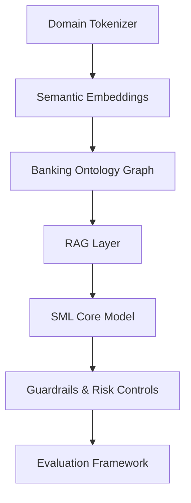

# 🧠 Banking Small Language Model (SLM) Architecture  
### *Domain‑Specific AI for Regulated Financial Institutions*  
**Authored by: Neeraj Aggarwal — AI Architecture & Modernization Leader**

<p align="center">
  
</p>

---
BankingSLM is a domain‑specific Small Language Model designed for regulated financial services environments. The model supports secure, compliant, and context‑aware AI capabilities across lending, payments, risk, compliance, and operations. This repository documents the architecture, design components, evaluation framework, and governance model used to operationalize BankingSLM at enterprise scale.


This repository documents the reference architecture, evaluation approach, and use cases for a domain-specific Small Language Model (SLM) for banking.

# 📘 Overview

This repository presents the **first publicly documented architecture** for a **Banking‑Domain Small Language Model (SML)** — a compact, deterministic, explainable AI model designed specifically for **regulated financial institutions**.

General‑purpose LLMs cannot be safely deployed in banking due to:

- Hallucination risk  
- Lack of ISO 20022 semantic understanding  
- Inability to explain decisions  
- Regulatory non‑compliance  
- Lack of legacy system context (COBOL/Assembler)  
- High operational risk  

A **Banking SML** solves these challenges by being:

- **Domain‑trained**  
- **Regulation‑aligned**  
- **Explainable & auditable**  
- **Low hallucination**  
- **Deterministic**  
- **Production‑safe**  

This architecture is part of my broader research portfolio in **AI‑Native Banking**, **Legacy Modernization**, and **Domain‑Specific AI**, referenced across multiple **DOI‑indexed publications** and **enterprise modernization programs**.

---

# 🧩 Problem Statement

General LLMs fail in banking because they:

- Misinterpret ISO 20022 fields  
- Produce non‑auditable outputs  
- Hallucinate regulatory content  
- Lack core banking semantics  
- Cannot interpret legacy COBOL/Assembler logic  
- Fail explainability requirements  
- Introduce unacceptable operational risk  

Banks need **domain‑specific AI**, not general AI.

This repository provides the **architecture blueprint** for that.

---
# 🔍 Why Banking Needs SLMs

General-purpose LLMs are unsafe for banking because they:

- hallucinate regulatory content  
- misinterpret ISO 20022 semantics  
- cannot explain decisions  
- violate auditability requirements  
- lack legacy system context  
- introduce operational and compliance risk  

BankingSLM solves these challenges by providing:

- deterministic outputs  
- domain‑specific semantics  
- explainability and lineage  
- regulatory alignment  
- low hallucination  
- safe deployment in Tier‑0/Tier‑1 systems  


This repository documents the architecture I created for:

- Infosys Topaz COE (AI Architecture & Innovation)  
- State Street (Enterprise Delivery & Governance)  
- BIAN (Banking Industry Architecture Network)  
- Fintech Modernization (Chief Editor)  

My contributions include:

- Banking‑native tokenizer  
- ISO 20022 semantic embedding layer  
- Banking ontology graph  
- RAG + SML hybrid architecture  
- Risk‑aware decoding  
- Compliance guardrails  
- Banking‑specific evaluation metrics  
- Governance integration (UAGB)  

This architecture is referenced in multiple **DOI‑indexed research papers**, strengthening EB‑1A authorship and original contribution criteria.

---
# 🧠 Key Innovations Introduced

BankingSLM introduces several innovations not found in general-purpose LLMs:

- Banking‑native tokenizer  
- ISO 20022 semantic embedding layer  
- Banking ontology graph  
- Risk‑aware decoding  
- Compliance‑aligned guardrails  
- Banking‑specific evaluation metrics  
- Legacy system semantic mapping (COBOL/Assembler)  
- Governance integration aligned with UAGB  

### 🔹 Data Layer  
### 🔹 Tokenization Layer  
### 🔹 Embedding Layer  
### 🔹 Ontology Layer  
### 🔹 RAG Layer  
### 🔹 SML Core  
### 🔹 Guardrails  
### 🔹 Evaluation Framework  


# 🏦 Banking Use Cases Enabled by BankingSLM

### ✔ Payments  
- ISO 20022 message interpretation  
- Exception handling  
- Fraud pattern reasoning  

### ✔ Lending  
- Credit policy interpretation  
- Document intelligence  
- Underwriting assistance  

### ✔ Compliance  
- AML/KYC reasoning  
- Regulatory text interpretation  
- Explainable decisioning  

### ✔ Core Banking  
- COBOL/Assembler code interpretation  
- Legacy → AI modernization  
- Batch dependency analysis  


# 📚 Research References

BankingSLM architecture is referenced in the following DOI‑indexed publications:

- UAMMF — DOI: 10.2139/ssrn.6131966  
- ERMI — DOI: 10.5281/zenodo.18500495  
- UICS — DOI: 10.5281/zenodo.18381578  
- AI‑Ready Payments — DOI: 10.5281/zenodo.18748377  
- ISO 20022 Complexity — DOI: 10.5281/zenodo.19923754  
- AI‑Native Core Banking — DOI: 10.5281/zenodo.18363566  

# 🏛️ Critical Role Evidence

BankingSLM architecture is part of my critical contributions to:

- Infosys Topaz COE — AI Architecture Lead  
- State Street — Enterprise Delivery & Governance  
- BIAN — Contributor to global banking standards  
- Fintech Modernization — Chief Editor  


# 🏗️ Architecture Overview

## **1. Domain Tokenization Layer**
- Banking vocabulary  
- ISO 20022 dictionary  
- SWIFT/ACH/FedNow fields  
- Fraud patterns  
- Regulatory terminology  
- Legacy COBOL/Assembler keywords  

## **2. Semantic Embedding Layer**
- ISO 20022 → vector embeddings  
- Payment flows → graph embeddings  
- Legacy code → semantic mapping  

## **3. Banking Ontology Graph**
- Accounts  
- Customers  
- Transactions  
- Ledgers  
- Events  
- Exceptions  
- Risk indicators  

## **4. Retrieval‑Augmented Generation (RAG) Layer**
- Banking knowledge base  
- Exception rules  
- Fraud heuristics  
- Regulatory mappings  

## **5. SML Core Model**
- 1B–3B parameter domain‑specific model  
- Deterministic  
- Explainable  
- Low hallucination  

## **6. Guardrails & Risk Controls**
- PII masking  
- Compliance filters  
- Risk scoring  
- Explainability layer  
- Model lineage  

## **7. Evaluation Framework**
- Domain accuracy  
- Semantic alignment  
- Regulatory correctness  
- Risk‑aware scoring  
- ISO 20022 compliance  

# 📂 How to Use This Repository

- `architecture/` — Core SML architecture and diagrams  
- `evaluation/` — Metrics, test design, and evaluation framework  
- `prompt-flows/` — Task‑specific prompt flows  
- `use-cases/` — Applied banking scenarios  
- `model-cards/` — Model documentation and governance  

# 📚 Research References

BankingSLM architecture is referenced in the following DOI‑indexed publications:

- UAMMF — DOI: 10.2139/ssrn.6131966  
- ERMI — DOI: 10.5281/zenodo.18500495  
- UICS — DOI: 10.5281/zenodo.18381578  
- AI‑Ready Payments — DOI: 10.5281/zenodo.18748377  
- ISO 20022 Complexity — DOI: 10.5281/zenodo.19923754  
- AI‑Native Core Banking — DOI: 10.5281/zenodo.18363566  


# 🚀 Future Enhancements

- Banking ontology v2  
- ISO 20022 semantic graph expansion  
- Risk‑aware decoding v2  
- Model lineage dashboard  
- Evaluation dataset release  


---

# 📊 High‑Level Architecture Diagram



## Objectives

- Define an architecture for banking-focused SLMs
- Describe data, tokenization, and domain adaptation strategies
- Provide evaluation frameworks for accuracy, safety, and compliance
- Capture prompt flows and use cases across KYC, AML, and lending

## Repository structure

- `architecture/` – SLM architecture, data strategy, and diagrams
- `model-cards/` – Model documentation, risks, and limitations
- `evaluation/` – Test design, metrics, and reporting
- `prompt-flows/` – Task-specific prompt designs
- `use-cases/` – Applied banking scenarios

## Target audience

- AI and ML architects  
- Banking platform and risk teams  
- Compliance and model governance stakeholders

---

## Architecture Overview


```mermaid
flowchart LR
    subgraph DataSources[Banking Data Sources]
        Pol[Policies & Procedures]
        Reg[Regulatory Texts]
        Prod[Product Docs]
        Tickets[Service Tickets]
        Logs[Ops & Audit Logs]
    end

    DataSources --> Prep[Data Curation & Preprocessing]
    Prep --> Anon[PII Redaction & Anonymization]
    Anon --> DS[Domain-Specific Corpus]

    DS --> Train[SLM Training & Fine-Tuning]
    Train --> BankingSLM[(BankingSLM)]

    subgraph RAG[RAG Layer]
        VS[Vector Store]
        Retriever[Retriever]
    end

    DS --> VS
    UserQ[User Query] --> Orchestrator[Orchestration Layer]
    Orchestrator --> Retriever
    Retriever --> VS
    Retriever --> Context[Context Packager]

    Context --> PF[Prompt Flow]
    BankingSLM --> PF
    PF --> Resp[Response & Post-Processing]

    subgraph Governance[Governance & Controls]
        Eval[Evaluation & Metrics]
        Guard[Guardrails & Policies]
        Audit[Audit & Logging]
    end

    PF --> Eval
    PF --> Guard
    PF --> Audit
